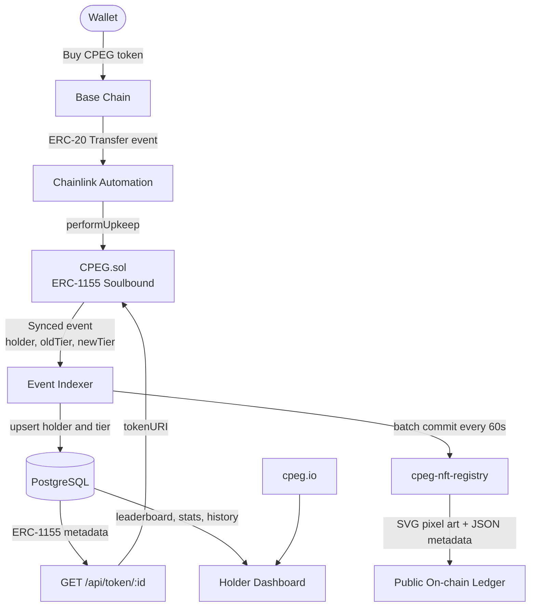

# CPEG

**Commit Photographic Experts Group**

Dynamic soulbound NFT protocol on Base. Buy CPEG tokens and automatically receive a pixel art NFT. Hold more, tier up. Sell, tier down. Higher tiers earn a larger share of trading fee rewards.

---

## How It Works

---

## Tiers

| Tier | Balance | Multiplier |
|---|---|---|
| Common | 10M+ CPEG | 1.0x |
| Uncommon | 50M+ CPEG | 1.5x |
| Rare | 100M+ CPEG | 2.0x |
| Epic | 500M+ CPEG | 2.5x |
| Legendary | 1B+ CPEG | 4.0x |
| Mythic | 2B+ CPEG | 6.0x |

---

## Repos

| Repo | Description |
|---|---|
| [cpeg-contracts](https://github.com/CPEG-Labs/cpeg-contracts) | Solidity smart contracts. ERC-1155 soulbound NFT with Chainlink Automation on Base. |
| [cpeg-app](https://github.com/CPEG-Labs/cpeg-app) | Full stack web app. Landing page, Express API, on-chain event indexer. |
| [cpeg-nft-registry](https://github.com/CPEG-Labs/cpeg-nft-registry) | Public append-only ledger. Every NFT mint, burn, and tier change as JSON and SVG. |

---

## Contract (Base Sepolia Testnet)

`0x2E0033cBEf75c07c145080CC759cB04BAf0876E2`

---

Website: [cpeg.io](https://cpeg.io)
