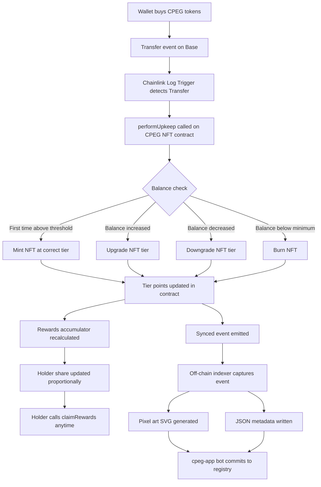

# CPEG: Commit Photographic Experts Group

CPEG is a dynamic soulbound NFT protocol on Base.

Every wallet that holds CPEG tokens automatically receives a pixel art NFT.
The NFT tier upgrades as you accumulate more tokens, and downgrades if you sell.
No manual claim. No staking. Just hold.

Your NFT is a live reflection of your position. Buy more and it evolves.
Sell and it degrades. Sell everything and it disappears. And higher tiers
earn a larger share of protocol fee rewards automatically.

## How It Works

CPEG uses an ERC-1155 soulbound contract with Masterchef-style tier logic,
paired with Chainlink Automation for trustless, permissionless execution.

When a CPEG token transfer occurs on-chain, a Chainlink Log Trigger upkeep
detects the event and calls `performUpkeep` on the NFT contract. The contract
reads the holder's current token balance, maps it to a tier, and either mints
a new NFT, upgrades the existing one, downgrades it, or burns it entirely.
All of this happens automatically within the same block cycle.

A second Custom Logic upkeep runs periodic sweeps over the active holder
watchlist to catch any tier drift that the log trigger may have missed.

Tier thresholds and reward multipliers:

| Tier       | Minimum Balance     | Reward Multiplier |
|------------|---------------------|-------------------|
| Common     | 10,000,000 CPEG    | 1.0x              |
| Uncommon   | 50,000,000 CPEG    | 1.5x              |
| Rare       | 100,000,000 CPEG   | 2.0x              |
| Epic       | 500,000,000 CPEG   | 2.5x              |
| Legendary  | 1,000,000,000 CPEG | 4.0x              |
| Mythic     | 2,000,000,000 CPEG | 6.0x              |

NFTs are soulbound. They cannot be transferred or sold.
Your tier reflects your conviction, not your trading history.

## Reward System

Protocol trading fees are deposited directly into the CPEG NFT contract
as ETH. Rewards are distributed proportionally across all active NFT holders
using a Masterchef-style accumulator, weighted by each holder's tier multiplier.

Higher tiers hold more reward points. A Mythic holder earns 6x the rewards
of a Common holder per unit of time, purely from holding. No staking, no
locking, no separate claim contract. Rewards accrue automatically and can
be claimed at any time by calling `claimRewards()`.

Any ETH sent directly to the contract or via `depositRewards()` is
immediately distributed across the active holder pool. The accumulator
updates in real time on every tier sync.

## Protocol Flow

## Off-Chain Infrastructure

Every on-chain tier event is captured by a real-time WebSocket indexer
connected to Base and committed to the registry automatically.

Each event produces two files:
- A pixel art `.svg` file representing the NFT at its new tier
- A `.json` metadata file containing tx hash, block number, holder address,
  event type (mint, upgrade, downgrade, burn), old tier, and new tier

All commits are authored by `cpeg-app[bot]` via GitHub App installation token.
No manual steps. Append-only. Nothing is overwritten.

## Repositories

| Repo | Description |
|------|-------------|
| [cpeg-contracts](https://github.com/CPEG-Labs/cpeg-contracts) | ERC-1155 soulbound NFT contract and Chainlink Automation integration |
| [cpeg-app](https://github.com/CPEG-Labs/cpeg-app) | Landing page, REST API server, and real-time on-chain indexer |
| [cpeg-nft-registry](https://github.com/CPEG-Labs/cpeg-nft-registry) | Append-only public ledger of every NFT lifecycle event with pixel art SVG |
